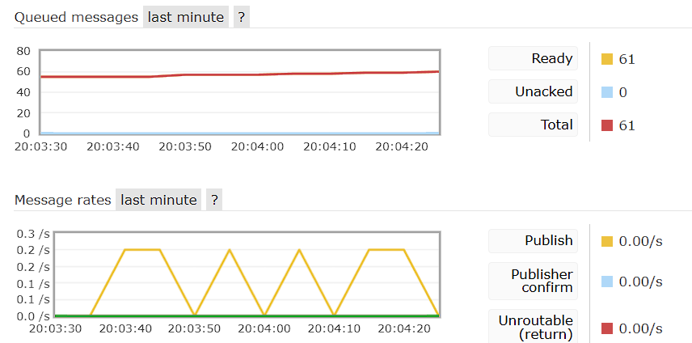

# Starting Project
- Command in Terminal: ```docker-compose up```.
- Then start rest-service and order-events-processor
- RabbitMQ is running on http://localhost:15673/, Username: guest, Password: guest
- 



# Errors

if command:
```
docker-compose up
```
leads to error: 

Error response from daemon: driver failed programming external connectivity on endpoint mkss-rest-service-rabbitmq-1 (d32ce076a804294ac77f2cb615ee20ef84c541a40a1d397f72a14e9933a4e7fb): failed to bind port 0.0.0.0:5672/tcp: listen tcp4 0.0.0.0:5672: bind: address already in use

stop process:
```
taskkill /PID 11104 /F

```

or:

-> I have changed the external port from 5672 to 5673, as I already had another RabbitMQ running on 5672.
-> and 15672 to 15673

# Direct exchange or fanout exchange
fanout has been chosen:
- Messages can be sent to multiple applications
- no routing logic is required
- if specific forwarding is required in the future, you can switch to direct exchange
- Every order should trigger an event
- allows experimentation with multiple consumers